<!-- ===== HEADER ===== -->
<p align="center">
  
</p>

<p align="center">
  
</p>

<p align="center">
  <a href="https://www.linkedin.com/in/badii-boussaidi-030744208/">
    
  </a>
  
</p>

---

## 🚀 About Me

```php
<?php

class BadiiBoussaidi
{
    public string $role     = 'Software Engineer';
    public string $location = 'Tunisia 🇹🇳';
    public array  $focus    = ['Backend', 'Web Applications', 'System Design'];
    public array  $passions = ['Music 🎶', 'Theater 🎭', 'Creative Arts 🎨'];

    public function motto(): string
    {
        return 'Learn by building.';
    }
}
```

- 🔭 Building web applications with **Symfony**, **Spring Boot** and **React**
- 🌱 Always learning: system architecture, APIs and automation
- 🤝 Open to collaborations and freelance projects
- 🎭 When I'm not coding, I'm playing music or acting on stage

---

## 🛠️ Tech Stack

<div align="center">

| Area | Technologies |
|:---:|:---|
| **Backend** |  |
| **Frontend** |  |
| **Tools** |  |

</div>

---

## 📊 GitHub Stats

<p align="center">
  
  
</p>

<p align="center">
  
</p>

---

## 📫 Connect with Me

<p align="center">
  <a href="https://www.linkedin.com/in/badii-boussaidi-030744208/" target="_blank">
    
  </a>
  <!-- Uncomment and add your email if you want it public:
  <a href="mailto:your.email@example.com">
    
  </a>
  -->
</p>

<!-- ===== FOOTER ===== -->
<p align="center">
  
</p>